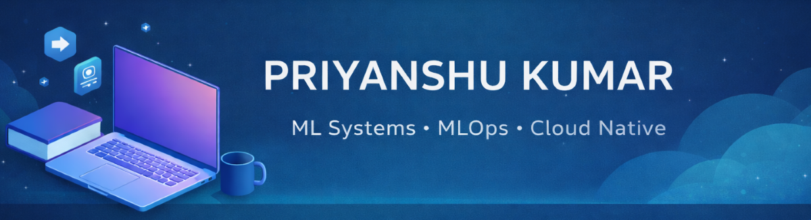

  

# 👋 Hi, I'm Priyanshu Kumar

🎓 CSE (Artificial Intelligence & Machine Learning) student  
🌱 Open-source contributor  
🚀 Interested in ML Systems, MLOps, and Cloud-Native Tools

  
   &nbsp;&nbsp;&nbsp;&nbsp;

  
 &nbsp;&nbsp;&nbsp;&nbsp;

 

### 🧠 What I’m Working On
- Learning ML systems beyond notebook-based workflows
- Exploring scalable ML pipelines and orchestration
- Studying experimentation and model lifecycle practices
- Understanding cloud-native approaches for ML systems

- ### 🛠️ Technologies

  

  

